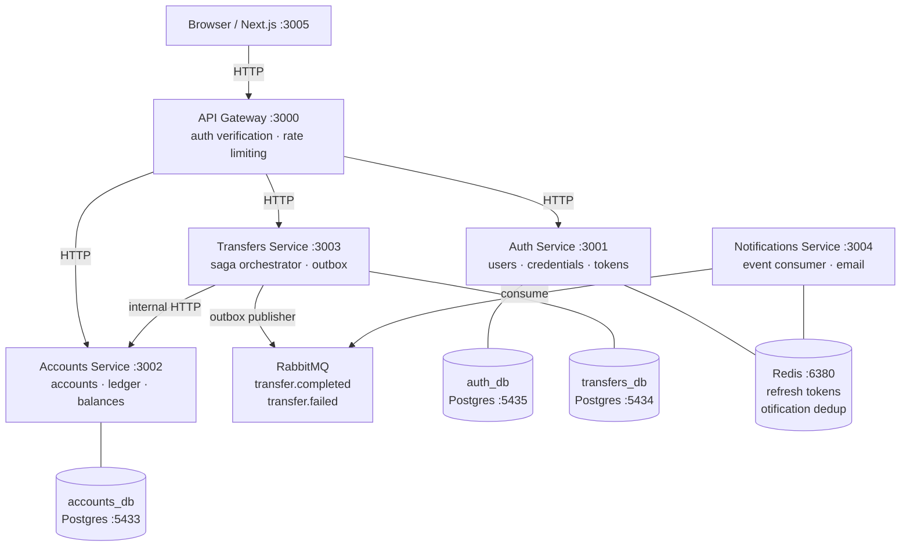
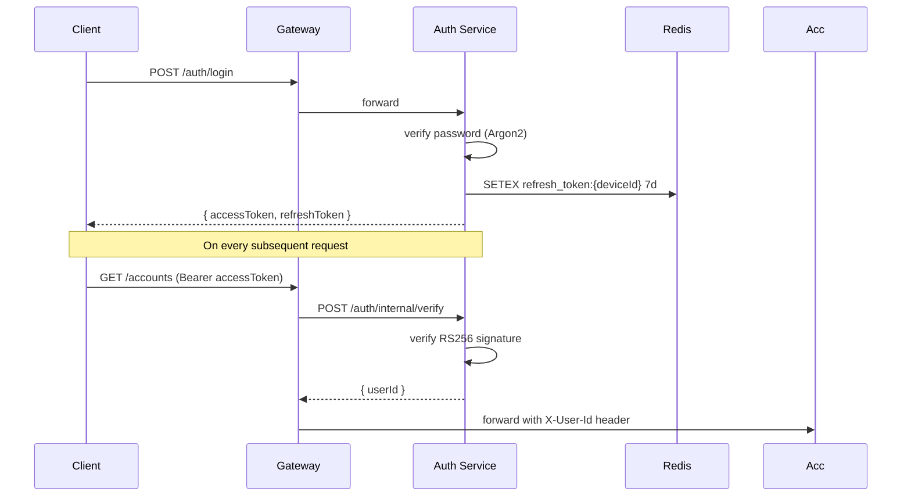
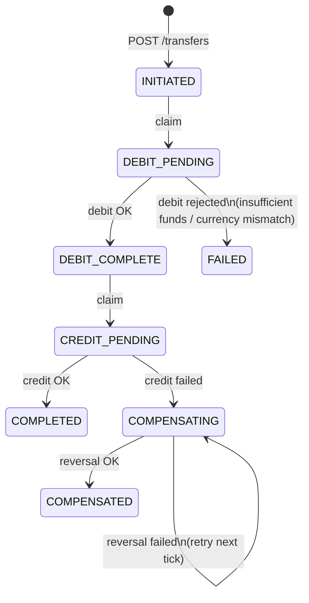
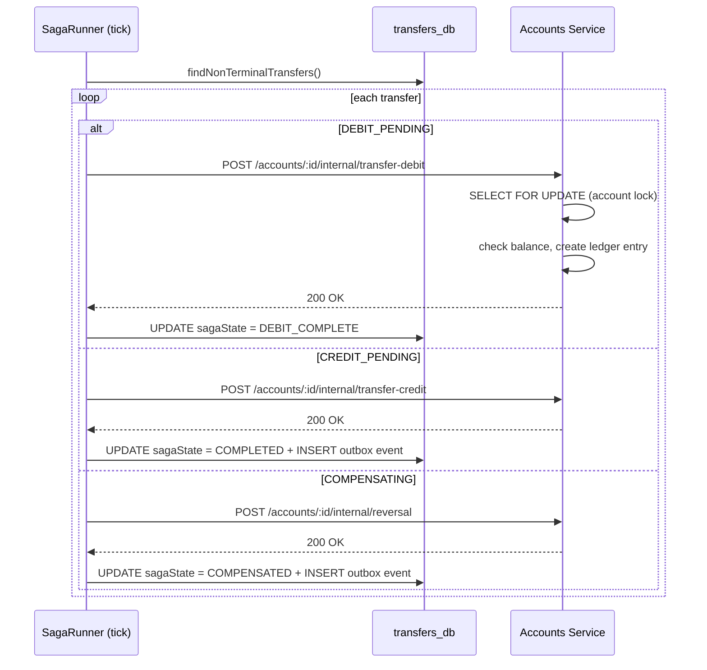
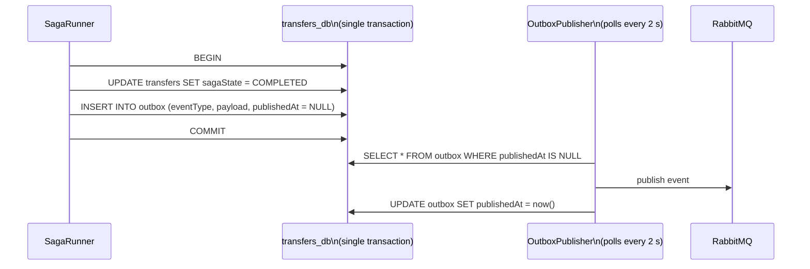
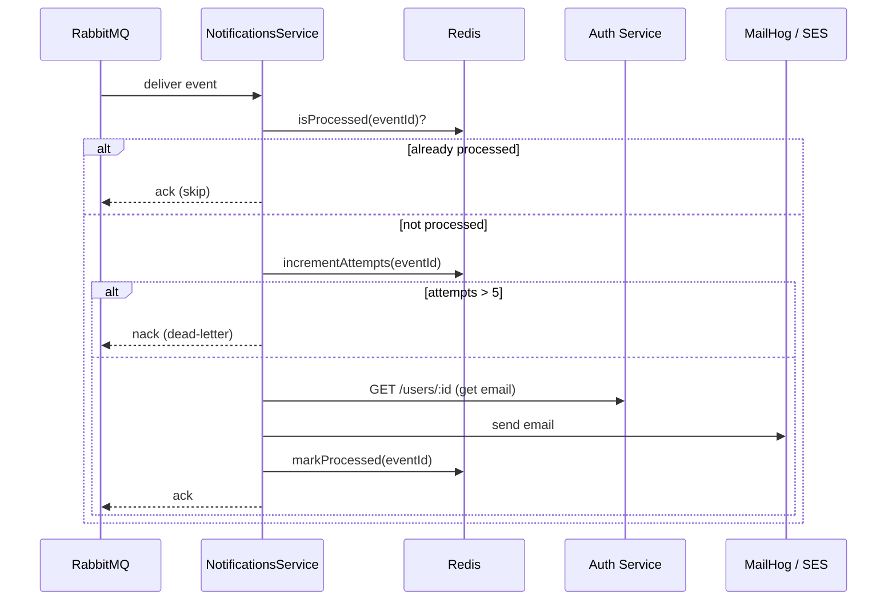
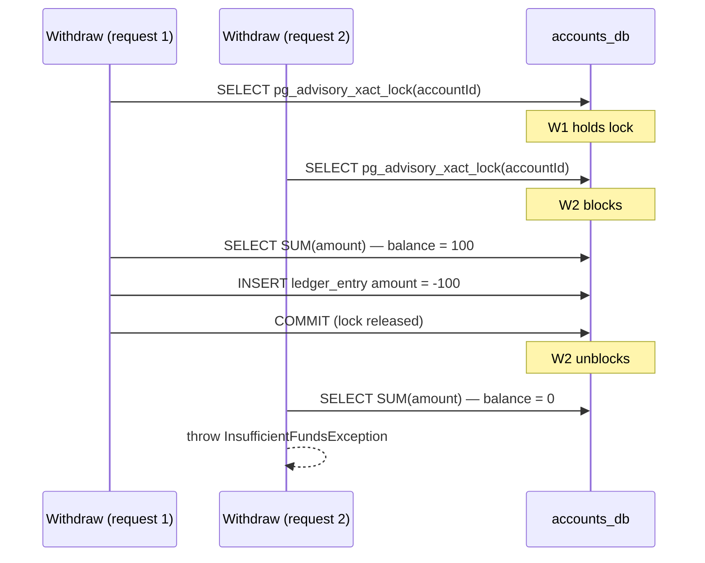

# Architecture

## System overview

MiniBank is a microservices banking platform. All HTTP traffic enters through a
single API Gateway. Five backend services own distinct bounded contexts and
communicate via synchronous HTTP (for commands) and RabbitMQ (for events).
Each service has its own PostgreSQL database — no service reads another
service's tables directly.



---

## Auth flow

Registration stores a user row with an Argon2-hashed password. Login issues
a short-lived RS256 access token (15 min) and a long-lived refresh token
stored in Redis against a device ID.



Refresh token rotation: on `POST /auth/refresh`, the old token is deleted and
a new pair is issued. If a refresh token is reused (already deleted), the
entire device's token family is invalidated — detecting a stolen token.

---

## Transfer saga

A transfer is a distributed transaction across two accounts that live in the
same Accounts database but are managed by a separate service. There is no
cross-database transaction. Instead, the Transfers service runs a saga with
explicit state and compensation.

### State machine



Terminal states: `COMPLETED`, `COMPENSATED`, `FAILED`.

The `INITIATED → DEBIT_PENDING` and `DEBIT_COMPLETE → CREDIT_PENDING` transitions
are compare-and-swap (`UPDATE ... WHERE sagaState = ?`). Only one saga runner
instance can win each claim — making horizontal scaling safe by construction.

### Saga runner tick

`TransferSagaRunner` polls every `SAGA_POLL_INTERVAL_MS` (default 2 s) for all
non-terminal transfers and advances each one:



Every Accounts call is **idempotent**: it deduplicates on
`(accountId, relatedTransactionId, entryType)`. The saga runner is free to
crash and retry any step without risk of double-debit or double-credit.

---

## Outbox pattern

Writing to RabbitMQ in the same database transaction as the saga state change
would be two separate writes to two systems — if the process crashes after one
but before the other, the event is lost or duplicated. The outbox pattern
collapses this into a single Postgres commit.



If the OutboxPublisher crashes after publishing but before marking the row, it
will re-publish on the next poll. Consumers handle this with Redis-backed
event deduplication (`EventDedupService`).

---

## Notification consumer

The Notifications service consumes `transfer.completed` and `transfer.failed`
events. It retries up to 5 times (tracked in Redis). On the 6th attempt it
throws `PermanentFailureError`, which causes the RabbitMQ consumer to
`nack` without requeue — the message moves to the dead-letter queue.



---

## Concurrency — ledger locking

Every balance-changing operation in the Accounts service acquires a
Postgres advisory lock on the account ID before reading or writing the ledger.
This prevents two concurrent withdrawals both seeing a sufficient balance and
both succeeding.



---

## Data models

### Auth service

```
users
  id          uuid PK
  email       text UNIQUE
  password    text          -- Argon2 hash
  created_at  timestamptz

refresh_tokens
  id          uuid PK
  user_id     uuid FK → users
  device_id   text
  token_hash  text UNIQUE
  expires_at  timestamptz
  revoked_at  timestamptz
```

### Accounts service

```
accounts
  id          uuid PK
  user_id     uuid          -- denormalized, no FK to auth_db
  currency    enum(USD,EUR,GBP)
  status      enum(ACTIVE,CLOSED)
  created_at  timestamptz

ledger_entries
  id                      uuid PK
  account_id              uuid FK → accounts
  amount                  decimal(20,8)  -- negative for debits
  type                    enum(DEPOSIT,WITHDRAWAL,TRANSFER_DEBIT,
                               TRANSFER_CREDIT,REVERSAL)
  related_transaction_id  uuid           -- transfer ID for idempotency
  description             text
  created_at              timestamptz
```

Balance = `SELECT SUM(amount) FROM ledger_entries WHERE account_id = ?`.
The table is append-only — rows are never updated or deleted.

### Transfers service

```
transfers
  id              uuid PK
  user_id         uuid
  from_account_id uuid
  to_account_id   uuid
  amount          decimal(20,8)
  currency        enum(USD,EUR,GBP)
  saga_state      enum(INITIATED,DEBIT_PENDING,DEBIT_COMPLETE,
                       CREDIT_PENDING,COMPLETED,COMPENSATING,
                       COMPENSATED,FAILED)
  failure_reason  text
  correlation_id  uuid
  created_at      timestamptz
  updated_at      timestamptz

outbox
  id            uuid PK
  event_type    text
  payload       jsonb
  published_at  timestamptz   -- NULL until published
  created_at    timestamptz
```

---

## Observability

All 5 backend services expose `GET /metrics` in Prometheus text format.
Prometheus scrapes every 15 seconds. Grafana is pre-provisioned with a
MiniBank Overview dashboard.

| Metric                                     | Type      | Labels                      |
| ------------------------------------------ | --------- | --------------------------- |
| `http_requests_total`                      | Counter   | `job, method, path, status` |
| `http_request_duration_seconds`            | Histogram | `job, method, path, status` |
| `db_query_duration_seconds`                | Histogram | `job`                       |
| `db_slow_queries_total`                    | Counter   | `job`                       |
| `db_failed_queries_total`                  | Counter   | `job`                       |
| `db_connections_active`                    | Gauge     | `job`                       |
| `db_transaction_duration_seconds`          | Histogram | `job`                       |
| `auth_registrations_total`                 | Counter   | —                           |
| `auth_logins_total`                        | Counter   | `result`                    |
| `accounts_deposits_total`                  | Counter   | `currency`                  |
| `accounts_withdrawals_total`               | Counter   | `currency`                  |
| `transfers_total`                          | Counter   | `result`                    |
| `transfers_amount`                         | Histogram | `currency`                  |
| `transfers_in_flight`                      | Gauge     | `state`                     |
| `notifications_events_consumed_total`      | Counter   | `event_type`                |
| `notifications_events_dead_lettered_total` | Counter   | `event_type`                |

Seven alerting rules fire to Prometheus Alertmanager (configurable):
login failure rate, transfer failure rate, saga stuck detection,
compensating spike, notification dead-letter spike, slow query spike,
service down.
